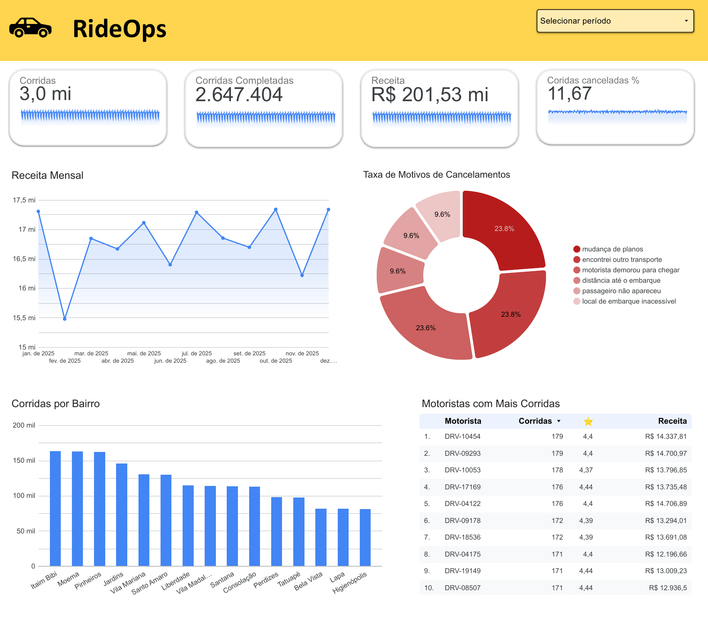
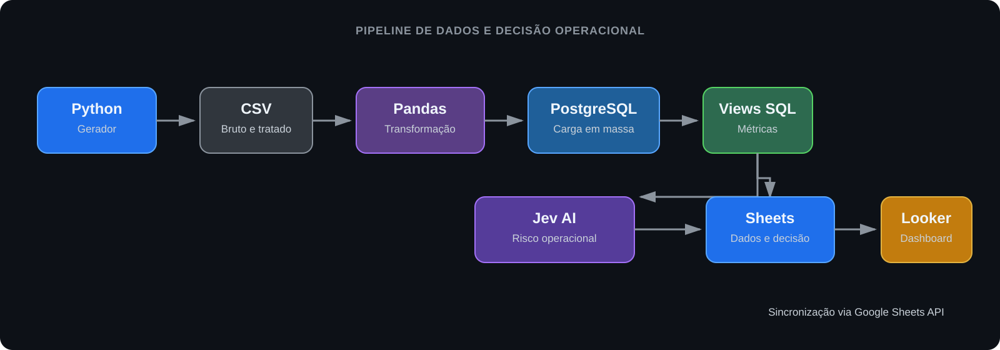

# RideOps

Pipeline de Data Operations que transforma 3 milhões de corridas sintéticas de São Paulo em dados analíticos, sincronizados com o Google Sheets e visualizados no Looker Studio.


## Dashboard



O dashboard acompanha volume de corridas, receita, taxa de cancelamento, desempenho por bairro e qualidade dos motoristas.

## O que este projeto demonstra

- Construção de um pipeline ponta a ponta: geração, transformação, carga, modelagem analítica e visualização.
- Processamento escalável de 3 milhões de registros com leitura e escrita em lotes, além de carga em massa no PostgreSQL.
- Criação de métricas operacionais em SQL para apoiar decisões sobre demanda, cancelamentos e qualidade do serviço.
- Integração automatizada com Google Sheets API por uma Service Account, com credenciais mantidas fora do repositório.

## Arquitetura



## Dados sintéticos

As corridas representam apenas a cidade de São Paulo, com variações de bairros, horários, demanda, distância, motoristas, avaliações e motivos de cancelamento. O gerador cria 3 milhões de registros por padrão e permite definir a quantidade e a semente para reproduzir o conjunto de dados.

## Como executar

Crie o arquivo local de configuração a partir do exemplo e defina uma senha para o banco:

```bash
cp .env.example .env
```

Inicie o PostgreSQL:

```bash
docker compose up -d
```

Gere, transforme e carregue os dados:

```bash
docker compose run --rm etl python src/generate_rides.py
docker compose run --rm etl python src/transform_rides.py
docker compose run --rm etl python src/load_rides.py
```

Crie as views analíticas:

```bash
for file in sql/views/*.sql; do docker compose exec -T postgres psql -U rideops -d rideops < "$file"; done
```

Execute os testes:

```bash
docker compose run --rm etl python -m pytest tests -q
```

## Camada analítica

As views SQL organizam os dados para consumo operacional e do dashboard:

- `vw_daily_operations`: volume de corridas, receita e cancelamentos por dia.
- `vw_neighborhood_performance`: demanda por bairro de origem e destino.
- `vw_cancellation_analysis`: cancelamentos por data e motivo.
- `vw_driver_quality`: indicadores de desempenho e avaliação dos motoristas.

## Sincronização com Google Sheets e Looker Studio

O script de sincronização lê as views do PostgreSQL e atualiza quatro abas da planilha Google: `daily_operations`, `neighborhood_performance`, `cancellation_analysis` e `driver_quality`. Quando uma decisão operacional foi gerada, ele atualiza também a aba `operational_decision`. O Looker Studio usa essas abas como fonte de dados.

Para habilitar a integração, configure no `.env` o ID da planilha e o caminho do JSON da Service Account. Compartilhe a planilha com o e-mail da Service Account como editor e mantenha o arquivo de credenciais em `secrets/`, diretório ignorado pelo Git.

```bash
docker compose run --rm etl python src/sync_dashboard_sheets.py
```

Também é possível exportar os dados localmente em CSV:

```bash
docker compose run --rm etl python src/export_dashboard_data.py
```

## Decisão operacional com Jev AI

O projeto usa o modelo gratuito `jev-1.13-free`, via BeatAPI, para classificar o risco da operação mais recente como `normal`, `atencao` ou `critico`. O modelo recebe somente métricas agregadas do dia e a comparação com a média dos sete dias anteriores. Ele também aponta o alerta prioritário e a necessidade de revisão humana.

Em caso de falha, resposta inválida ou ausência de chave, o pipeline gera `manual_review`; nenhuma ação é tomada automaticamente. A decisão é salva em `exports/operational_decision.csv` e, na sincronização seguinte, enviada para a aba `operational_decision` da planilha Google.

Configure `BEATAPI_API_KEY` no `.env` e execute:

```bash
docker compose run --rm etl python src/generate_operational_decision.py
docker compose run --rm etl python src/sync_dashboard_sheets.py
```

### Onde consultar o resultado

Depois de executar os comandos, a decisão pode ser vista em três lugares:

1. No arquivo local `exports/operational_decision.csv`. Essa pasta é ignorada pelo Git porque contém resultados gerados durante a execução.
2. Na aba `operational_decision` da planilha Google conectada ao projeto.
3. No Looker Studio, ao adicionar essa aba como uma nova fonte de dados e inserir uma tabela com os campos abaixo.

| Campo | Significado |
| --- | --- |
| `risk_level` | Classificação da operação: `normal`, `atencao`, `critico` ou `manual_review`. |
| `primary_alert` | Métrica que mais merece acompanhamento. |
| `requires_human_review` | Indica se uma pessoa deve revisar o cenário. |
| `risk_confidence` | Confiança do Jev na classificação de risco. |
| `review_probability` | Probabilidade estimada de precisar de revisão humana. |
| `decision_status` | `generated` para resposta válida do Jev ou `manual_review` para fallback seguro. |

No Looker Studio, use uma tabela simples para exibir a linha mais recente com `risk_level`, `primary_alert`, `requires_human_review` e `decision_status`. Isso evita tratar uma decisão categórica como métrica numérica.

## Qualidade e desempenho

- Testes automatizados para gerador, transformação, carga, exportação e sincronização.
- Validação de colunas, tipos e regras dos dados antes da carga.
- Processamento de CSV em lotes para reduzir o consumo de memória.
- Carga por `COPY` no PostgreSQL para lidar com milhões de registros de forma eficiente.

## Estrutura

```text
data/          dados brutos e tratados, ignorados pelo Git
docs/images/   imagem do dashboard
exports/       decisões e exportações locais, ignoradas pelo Git
sql/init/      criação e evolução da tabela principal
sql/views/     views analíticas
src/           scripts do pipeline
tests/         testes automatizados
secrets/       credenciais locais, ignoradas pelo Git
```

## Próximas melhorias

- Orquestrar o pipeline com agendamento.
- Adicionar carga incremental.
- Armazenar a camada tratada em Parquet.
- Adicionar monitoramento e alertas de qualidade dos dados.
